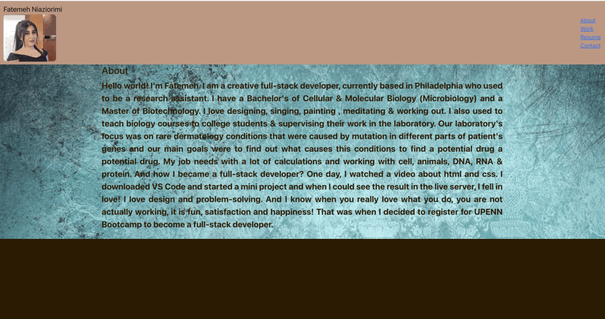

# React Portfolio

 ## Task

To create a react base portfolio app  which has different components like navbar, header, Footer and project etc. to showcase your skills to employers whose looking to hire a developer for either a full-time or part-time position that you are able to build a project whether it is in independent one that you start it from the scratch and finished it or collaborated with other developers which shows you are enable to work in team setting and with other developers which is an important factor in this field. Biulding an impressive and creative portfolio can introduce you and your projects (with the title, image, link to deployment and link to Github) to potential employer and showcase your talent and passion for writting the code.

 


## User Story

```md
AS AN employer
I WANT to view a potential employee's work samples of deployed portfolio 
SO THAT I can check their work samples and assess if they are a good candidate for our open positions
```


## Description


```
GIVEN I need to check work samples of a potential employee
WHEN I view their portfolio
THEN I am presented with a page that has header, a content section and a footer  
When I view the Navigation bar 
Than I am presented with potential employee's name, recent photo or and avatar and Navigation Titles like About, Work, Resume, Contact.
WHEN I click one of these Titles which are located in the navigation bar
THEN the UI scrolls and it takes me to the corresponding section
WHEN I click on the link with the title of work
THEN the UI takes me to a section with titled images of the developer's work and projects
WHEN I am presented with the developer's project and I can clike on the button under each project photo to go either to functional page to see the app or to Github to vew the codes
when I click on each app or project
THEN if choose to click on the Resume
THEN I will be presented with employee's resume in another page
WHEN I click on Contact in navigation
Then I will be taken to the contact section 
WHEN I can choose to click to each of the contact links like Github repo address, email address or Linkedin address
THEN I click on each of of them I will be taken to its corresponding page
```


## Mock-Up

The following animation shows the web application's appearance and functionality:




## Mock-Up

The following video shows the web application's appearance and functionality:

[User clicks through About Me, Portfolio, Resume, and Contact sections on the webpage and enters information on Contact page.](https://www.youtube.com/watch?v=h9BnkvAleeU)


### Techniques


  * Using the REACT for rendering.

  * Application has a single `Header`, `Project`, `Footer`and a `Navigation` , `Contact`components. 

  * Using bootstrap along with css

  * Application deployment on GitHub Pages.


- - -
## License

MIT License 2022. All Rights Reserved.
